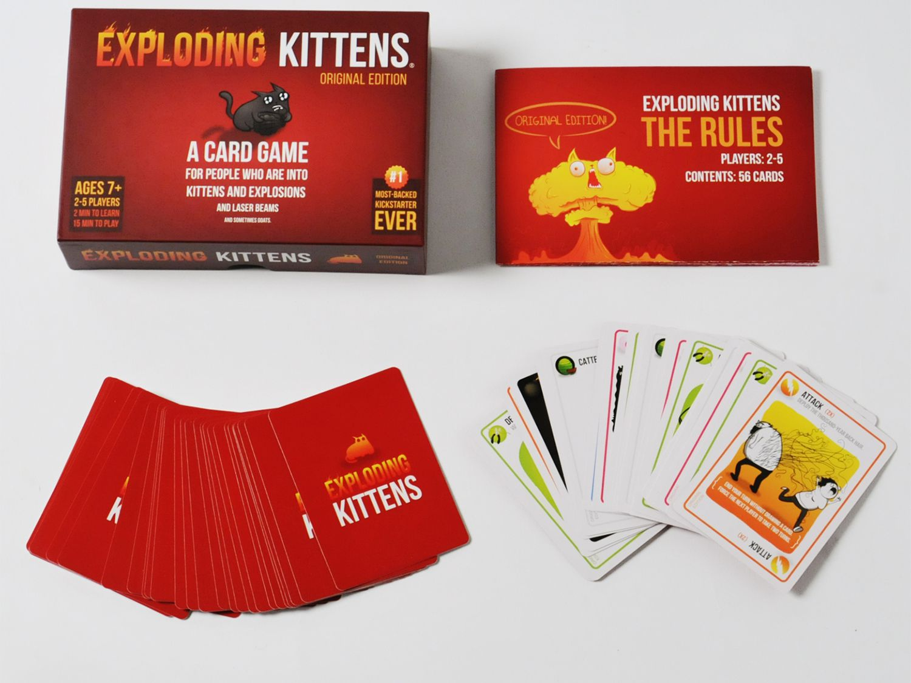

# exploding-kittens

Exploding Kittens is a very popular and fun card game to play with friends! If you have never played it, you need to check it out [here](https://www.explodingkittens.com/products/exploding-kittens-original-edition)

## Motivation

I have loved playing this card game with friends. And so being at the last week of my software engineering bootcamp, I decided to use the skills I have learnt to create an online version of this game, so that I can play with my friends anytime and anywhere!

##m Check out the application here!
[online version of exploding kittens](https://audreypatricia.github.io/exploding-kittens/)

### Technology Stack and Frameworks used
- Vue
- VueX
- Firebase
- Javascript
- HTML
- CSS

### Features
- Choose a username
- Choose to either host a game or join a game room
- Create a game room as a host and share the game pin for others to join
- take turns playing the card game
- action cards: skip, attack, see the future, favor, shuffle and combo cards
- timer for 3 seconds after each action to give the opportunity for other to play a "nope" card (at the moment the game only allows for one nope to be played at a time)
- winner announcement!

### Key Learnings

- I love Vue even more! It is such a great framework to use
- Learning to use async, await
- Practicing to code up logic with javascript!

### Future Improvements
- keeping user data even when page is refreshed
- music and making the game more interactive
- ability to chain "nope" plays

### Future Improvements
Special thanks to Joel and Mai, who are the best instructors. This would not be possible without them.
